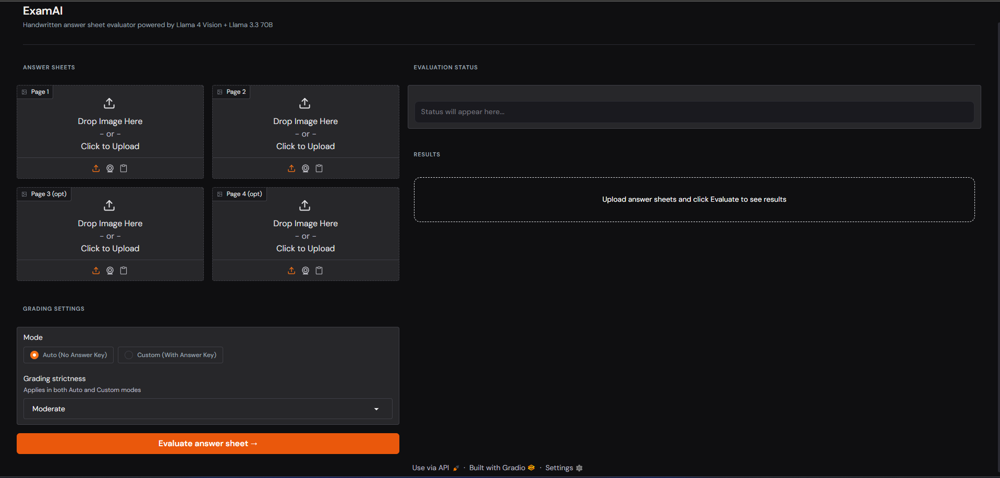
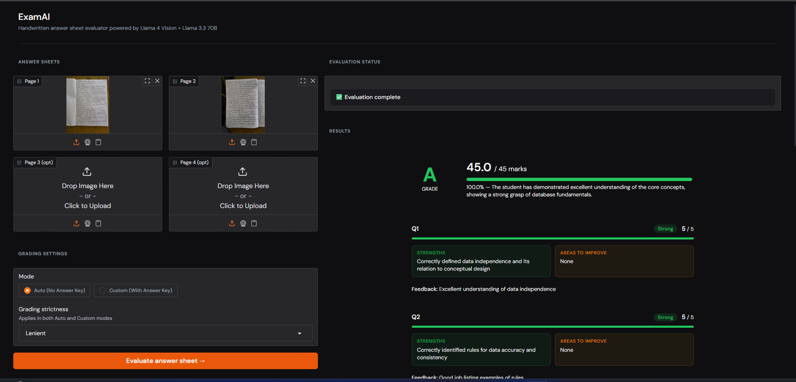
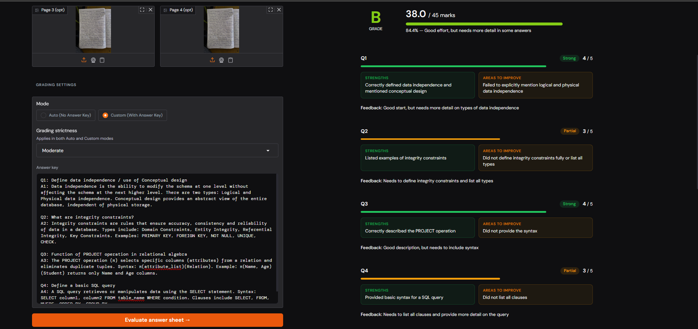

# ExamAI — Handwritten Answer Sheet Evaluator


An AI-powered web app that reads handwritten exam answer sheets from images, extracts the text, and evaluates answers automatically — generating structured per-question feedback with marks, grades, strengths, and improvement areas in seconds.

---

## Problem Statement

Evaluating handwritten answer sheets is slow, manual, and inconsistent. Result declaration takes weeks. Students receive a final mark with no insight into what went wrong or how to improve.

ExamAI automates the entire pipeline — from reading handwriting to generating detailed, actionable feedback — in a single click.

---

## How It Works

```
Handwritten Answer Sheet (Photo/Scan — up to 4 pages)
        ↓
Image Preprocessing (PIL)
        ↓
OCR Text Extraction (Llama 4 Scout Vision via Groq API)
        ↓
Question-wise Answer Segmentation
        ↓
AI Grading (Llama 3.3 70B via Groq API)
        ↓
Structured Feedback Report (Marks · Grade · Strengths · Improvement Areas)
```

---

## Screenshots

### Default Interface
The app on launch — upload answer sheet images and configure grading settings before evaluating.



### Auto Evaluation Result
Result after running in Auto mode — the AI reads the handwriting and grades answers independently without any answer key.



### Custom Evaluation Result
Result after running in Custom mode — the evaluator provides an answer key and chooses a strictness level, and the AI compares the student's answers against it.



---

## Grading Modes

ExamAI supports two distinct evaluation modes:

### Auto Mode (No Answer Key)
The AI evaluates the student's answers based on correctness, completeness, and conceptual understanding. No input from the evaluator is needed beyond the answer sheet images. Each answer is graded out of 5 marks by default.

### Custom Mode (With Answer Key)
The evaluator pastes a reference answer key in plain text. The AI compares the student's handwritten answers against the key and grades accordingly — making evaluation consistent and aligned with the expected answers.

Both modes support three levels of **grading strictness**:

| Strictness | Behaviour |
|---|---|
| **Strict** | Marks awarded only for precise, complete answers. Deductions for vagueness or partial responses. |
| **Moderate** | Balances correctness with understanding. Partial credit for mostly correct answers. |
| **Lenient** | Rewards demonstrated understanding. Generous partial credit focused on core concepts. |

---

## Features

- **Handwriting OCR** — Reads scanned or photographed answer sheets using Llama 4 Scout Vision (up to 4 pages per submission)
- **Two Grading Modes** — Auto grading or answer-key-based evaluation
- **Adjustable Strictness** — Three grading policies applicable in both modes
- **Per-question Feedback** — Marks awarded, strengths, weaknesses, and improvement suggestions for each question
- **Grade Report** — Final score, percentage, letter grade (A–F), and an overall comment
- **Live Status Updates** — Step-by-step progress during OCR and grading
- **Dark/Light UI** — Responsive Gradio interface with dark mode support
- **No Setup for End Users** — Web-based; no technical knowledge required

---

## Tech Stack

| Layer | Technology |
|---|---|
| Vision / OCR | Llama 4 Scout 17B (Groq API) |
| LLM Grading | Llama 3.3 70B Versatile (Groq API) |
| Frontend | Gradio |
| Backend | Python |
| Image Processing | Pillow (PIL) |

---

## Getting Started

### 1. Clone the Repository

```bash
git clone https://github.com/omermohammedfarooq/ocr-rag-answer-evaluation.git
cd ocr-rag-answer-evaluation
```

### 2. Install Dependencies

```bash
pip install groq gradio Pillow
```

### 3. Set Your API Key

Create a `.env` file in the root directory:

```env
GROQ_API_KEY=your_api_key_here
```

Get a free Groq API key at [console.groq.com](https://console.groq.com)

### 4. Run the App

```bash
python app.py
```

The Gradio interface will launch at `http://localhost:7860`. A public shareable link is also generated automatically.

---

## Usage

1. Upload at least one image of the handwritten answer sheet. Up to 4 pages are supported — additional pages are optional.
2. Select a grading mode:
   - **Auto** — upload images and click evaluate. No answer key needed.
   - **Custom** — select Custom mode, then paste the answer key into the text box that appears.
3. Choose a grading strictness level (Strict / Moderate / Lenient).
4. Click **Evaluate answer sheet →**.
5. The right panel shows live status updates, then displays the full graded report.

---

## Output Format

Each evaluation produces:

- **Letter grade** (A / B / C / D / F) with colour coding
- **Total score** and percentage with a progress bar
- **Per-question breakdown:**
  - Marks awarded / max marks
  - Status badge (Strong / Partial / Needs work)
  - Strengths panel
  - Areas to improve panel
  - Written feedback

---

## End Users

- **Faculty & Professors** — Automate evaluation, save hours per exam cycle
- **Colleges & Universities** — Scale grading without scaling effort
- **Coaching Institutes** — Fast feedback for practice tests
- **EdTech Platforms** — Integrate AI evaluation into existing workflows
- **Students** — Understand exactly where marks were lost and how to improve

---

## Project Structure

```
ocr-rag-answer-evaluation/
├── app.py                          # Main app — backend engine + Gradio UI
├── requirements.txt
├── .env.example
├── assets/
│   └── Screenshots/
│       ├── Default_ui.png
│       ├── Auto_Evaluation_Result.png
│       └── Custom_Evaluation_result.png
└── README.md
```

---

## Future Improvements

- [ ] PDF upload support for answer sheets
- [ ] Batch evaluation (multiple students at once)
- [ ] Multi-page support beyond 4 pages
- [ ] Custom rubric / marking scheme upload
- [ ] Student dashboard with historical feedback
- [ ] Export reports as PDF
- [ ] Integration with college ERP systems

---

## Author

**Mohammed Omer Farooq**
- GitHub: [@omermohammedfarooq](https://github.com/omermohammedfarooq)
- LinkedIn: [Mohammed Omer Farooq](https://linkedin.com/in/omermohammedfarooq)
- Email: omermohammedfarooq@gmail.com

---

## Acknowledgments

- [Groq](https://groq.com) — Ultra-fast LLM inference API
- [Meta AI](https://ai.meta.com) — Llama 4 Scout Vision and Llama 3.3 70B models
- [Gradio](https://gradio.app) — Web UI framework

---

## License

MIT License — see [LICENSE](LICENSE) for details.

---

## Why This Project

ExamAI was built to explore how multimodal AI and large language models can make educational evaluation faster, more scalable, and more feedback-oriented — rather than just marks-oriented.

The goal is not automated grading for its own sake. It's giving students the kind of specific, actionable feedback that actually helps them improve — instantly, and at scale.

---

*Built to make feedback faster, fairer, and actually useful.*
